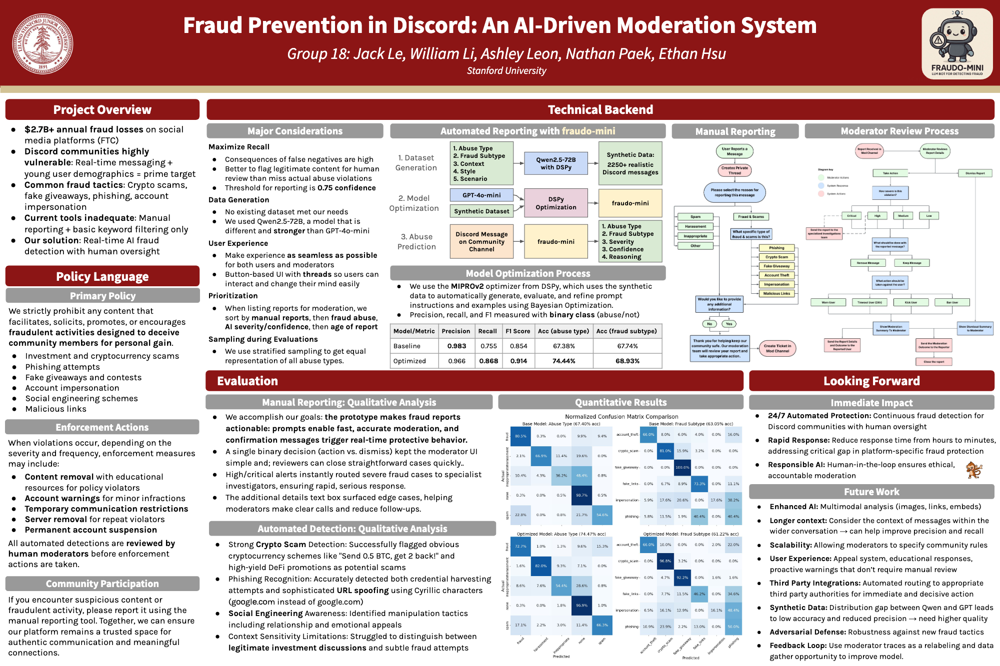

# fraudo-mini: Fraud Prevention in Discord

Group 18: Jack Le, William Li, Ashley Leon, Nathan Paek, Ethan Hsu
CS 152 Spring 2025

## Poster
[](assets/final/poster.pdf)


## Video Demo
The link for the video demo is [here](assets/final/demo.mp4).

## File Overview
```
/
├── assets/                        # Assets, including PDFs for poster and milestone
├── discordbot/                    # Main Discord bot application
├── visuals.ipynb                  # Jupyter notebook for visualizations
```

### Assets Directory (`assets/`)
Important files:
```
assets/
├── final/                         # Final presentation assets
│   ├── user.png                   # User flow diagram (final version)
│   ├── moderator.png              # Moderator flow diagram (final version)
│   └── poster.pdf                 # Poster
└── milestone/                     # Milestone documentation
    ├── user_flow.pdf              # User flow documentation
    ├── moderator_flow.pdf         # Moderator flow documentation
    └── milestone.pdf              # Milestone report
```

### Discord Bot Directory (`discordbot/`)
Main application code for the Discord moderation bot:
```
discordbot/
├── abuse_types.py                 # Abuse type definitions
├── agent.py                       # AI agent implementation
├── bot.py                         # Main Discord bot code
├── dataset_generator.py           # Dataset generation with Qwen2.5
├── helpers.py                     # Helper functions
├── moderation_flow.py             # Core moderation logic
├── optimized_agent.json           # Optimized agent configuration (using DSPy for 4o-mini)
├── report.py                      # Report generation
├── report_views.py                # Report view handlers
├── data/                          # Datasets for model training and evaluation
```